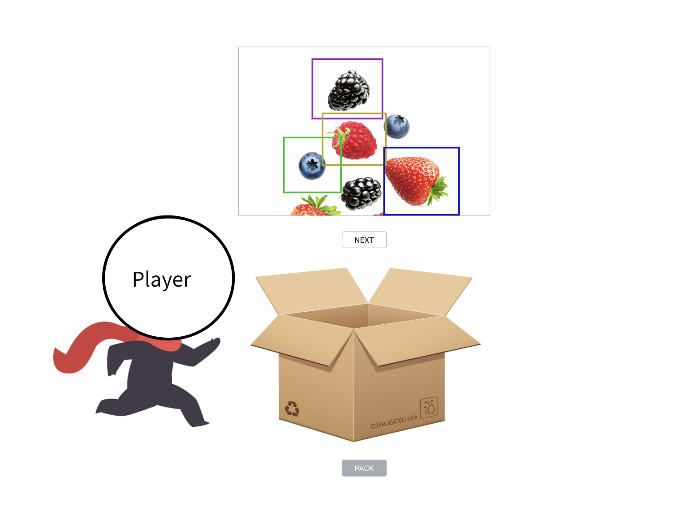
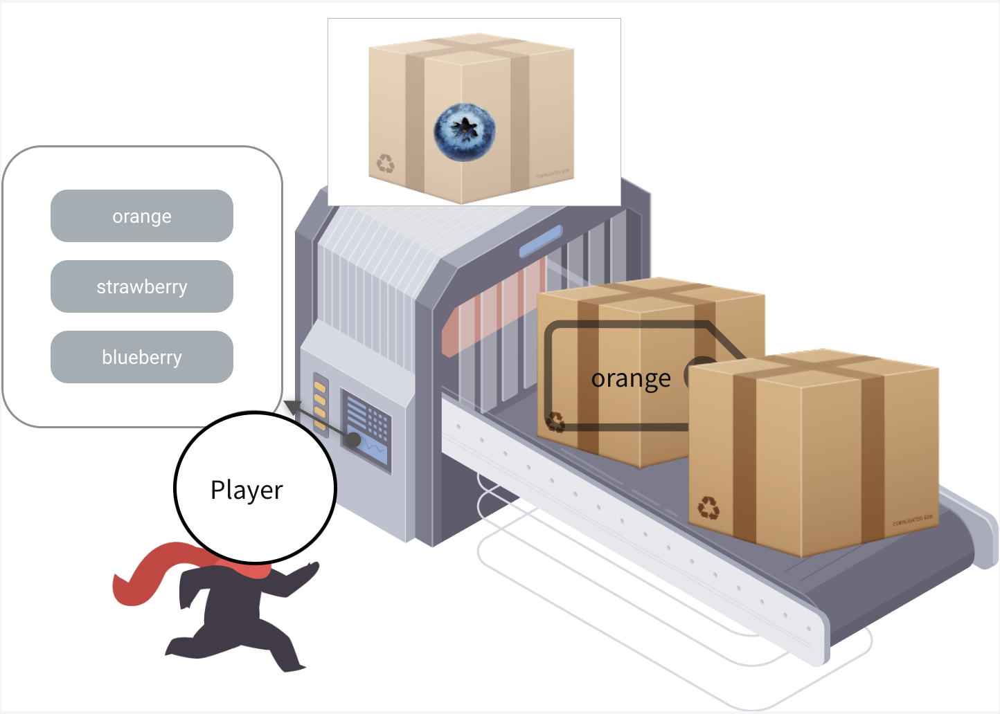
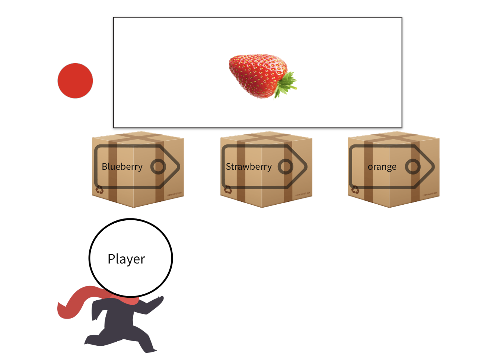
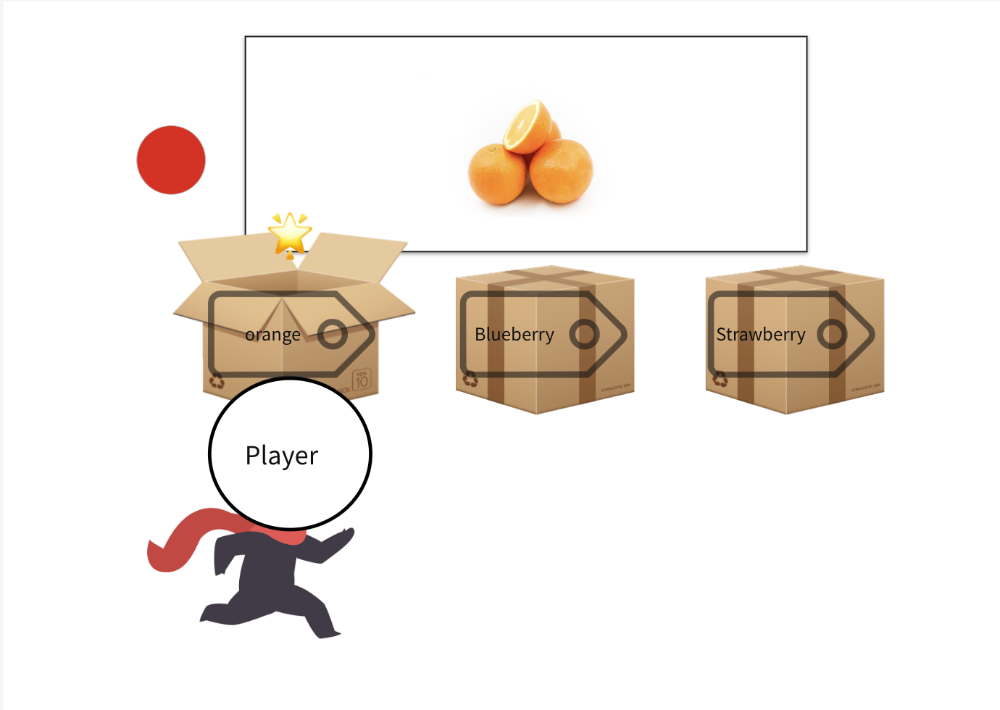
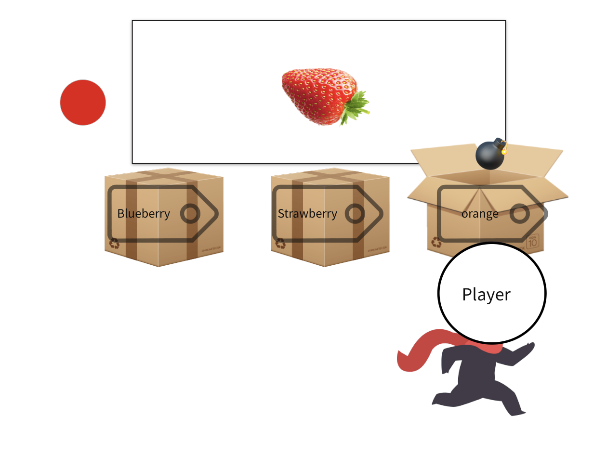
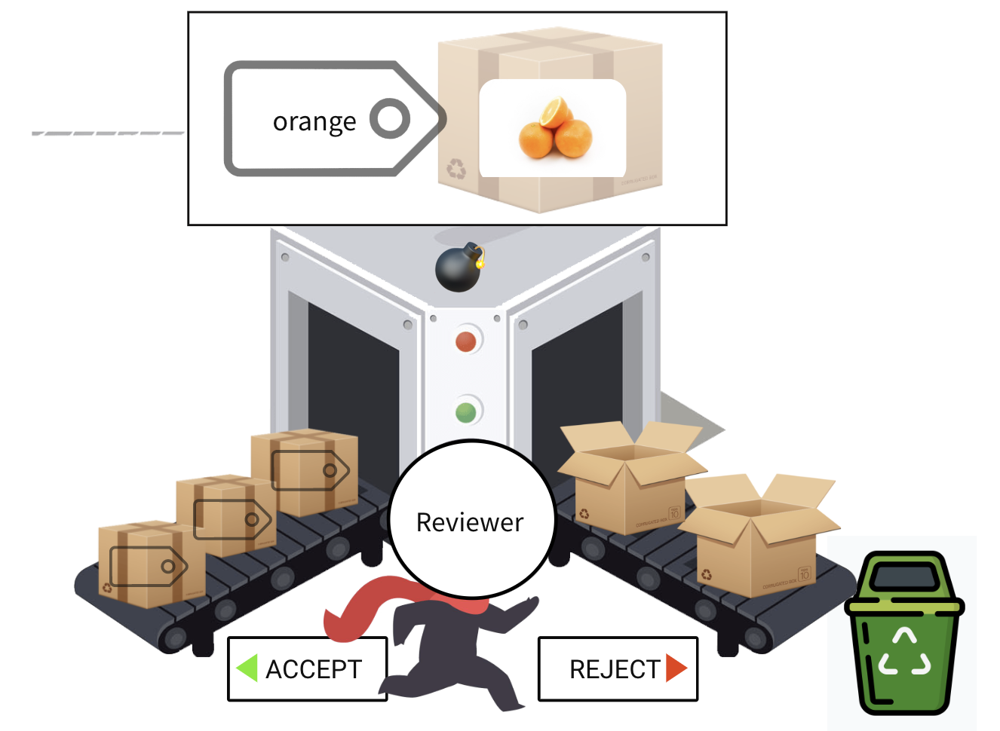
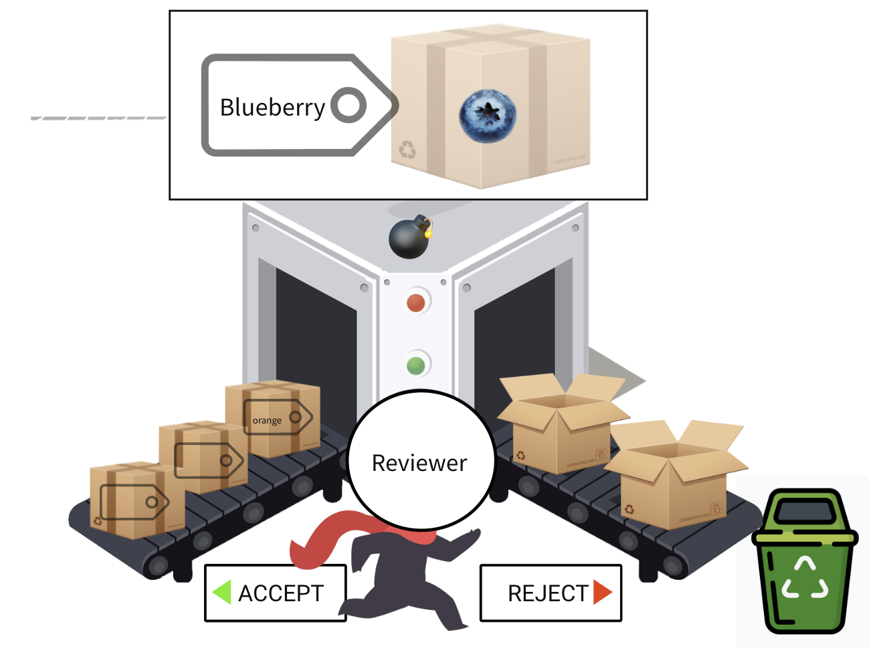
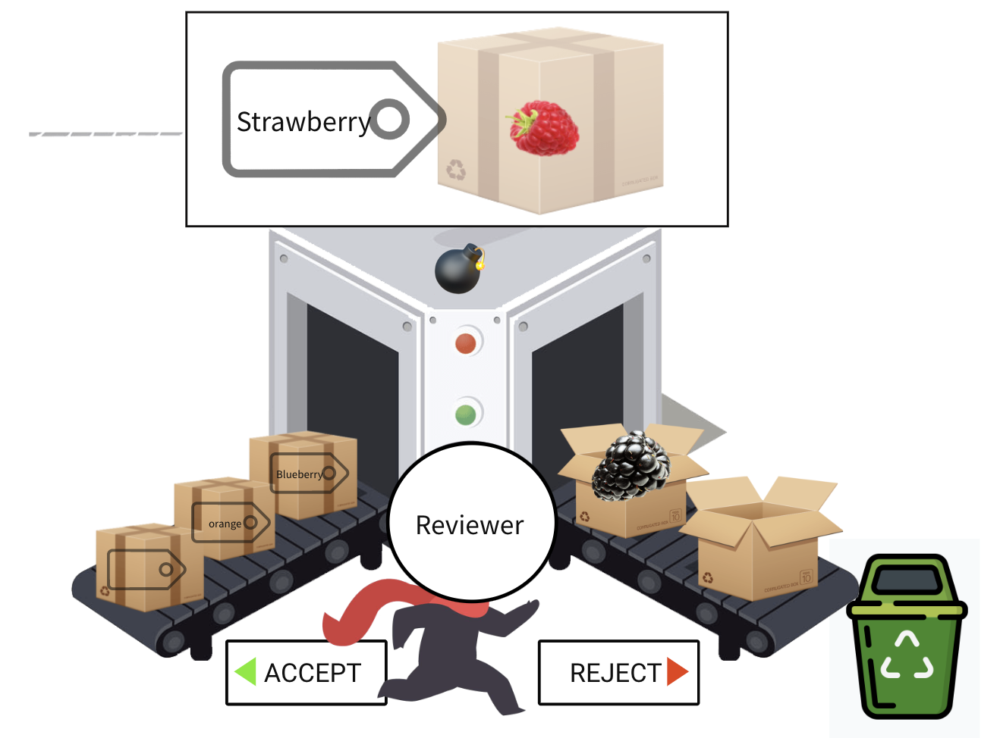

# Introduction to the User Interface (Prototypes)

** Demonstration Videos for User Interface
> [Packing Game](packing.mp4)

> [Labelling Game](labelling.mp4)

> [Guessing Game](guessing.mp4)

> [Reviewing Game](reviewing.mp4)

## Packing Game

The original images are shown on a screen in the packing game in order, and the player’s character in the game stands next to a carton.

- Each carton needs to contain a single object identified by the bounding box on the original image. Additionally, the packer is informed of all the possible objects that need to be extracted.

1.  The packer needs to draw a bounding box on the image shown on the screen. 
    - If there is more than one object to be labelled on the same image, the packer has the option to create multiple bounding boxes on the image simultaneously, and each selection will be added to its own carton.
    - If the packer already saves an object in a carton but wants to modify its bounding boxes, the packer can click on the closed carton, which will undo the selection.

2. After all the required objects on the image have been retrieved, the packer can move on to the next image by pressing the “Next” button (or some equivalent hotkey), and a
fresh empty carton will be delivered without any additional actions on the carton.

3. When finished, the original image name with required objects and the coordinates of the bounding boxes will be preserved.

## Labelling Game

The labeller character stands in front of a conveyor belt with a scanner, and cartons continuously arrive at the scanner and its contents revealed.

All the predefined possible label choices are shown (on a graphical keypad), with the ability to quickly select any one of these as the correct label for the given object.

1. The packer needs to press the button with the correct label.

2. The next scanned carton will be shown on the screen, and the label selected will appear on the carton that has been scanned.

Output: The label will be saved for the corresponding segment.

## Guessing Game

The guesser role will be given a rectangular selection of an image that has been labelled, however, the label is hidden from the player.

- Three cartons with possible correct labels float underneath, and the player has control of a character standing below the cartons. 

- On clicking a carton (or using the directional arrow keys on the keyboard) to guess the correct label, the character will move to that position) and jump to hit the box, inspired by classic 2D platformers such as Mario. 
    - If the carton that the guesser hits matches the existing label on the object, a star icon will appear to indicate success. 
    
    - Otherwise, a bomb icon will be displayed.
    

- If there is no label matching the labeller’s choice, the guesser can skip the object to the next one by clicking on the red button. The corresponding boxes for skipped objects appear different due to a red tag placed on it, and are left to review later in the game.

## Reviewing Game

 By default, the host who provides the raw data can be the reviewer. The reviewer can choose to accept or reject the annotated data.

- A scanner connected by an Y-shape conveyor belt is shown
to the reviewer. 
 

- The Reviewer can use the “Accept” or “Reject” buttons (or <- -> keys) to control which way the carton can go. 
    - If the carton is accepted, the carton will be moved to the left conveyor belt and remain sealed.
     
    - If rejected, the carton will be moved to the right and be unpacked.
     

- If the reviewer does not agree with both the object and the label, they can click a bomb icon to destroy the data object without requesting new bounding boxes.

- If all the cartons are accepted then the task is complete, the reviewer can choose to output the labelled data. 

- If some labelled objects are rejected, then the cartons will be sent back to the packer and labeller respectively so they need to redraw the bounding boxes or relabel the objects. 

